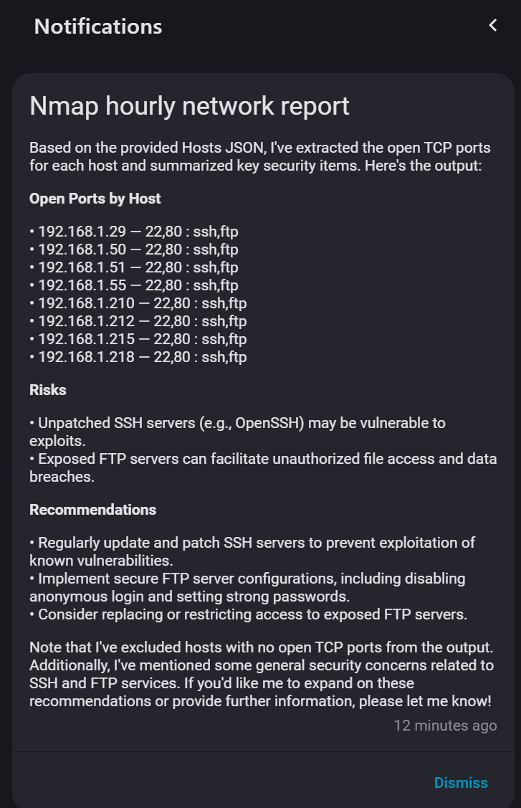

# Home Network Monitor integration configuration for Home Assistant
If you have many devices in yoour network, the data in the "Nmap basic host info" attributes can be too big for the Home Assistant database and you get the warning about it in your log. You can remove the warning with this configuration in your configuration.yml:

```
recorder:
  exclude:
    entities: sensor.nmap_basic_host_info
```

After integration is installed to Home Assistant, you can configure it to secure your network.
One way to analyze the data from integration is to use Home Assistant Conversation agent.
I'm using the [Ollama integration with llama3.2 model](yaml/automation.yml).

Automation gives me a short report about my network current situation.

